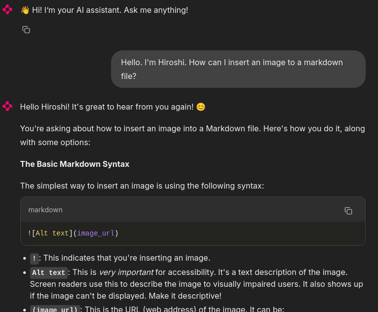

# chat_ai

A powerful Chat AI with context, RAG and chat history awareness.  Uses Gemma (via Ollama) and GPT LLM models.  Loads data from TXT, PDF, DOC, CSV, web pages (HTML), spreadsheets (XLS), presentations (PPTX), and LibreOffice documents (ODT).  Offers vectorization, summarization, and other helpful features.

Note: This README is mostly generated with the programs in this repository.


## Prerequisites

\*gemma\*.py programs rely on the following components:

* **Ollama:** A tool for running large language models locally. Ensure Ollama is installed and running on your system (defaults to localhost).
* **Gemini Model:** The program uses the `gemma3n:e4b` language model. This model must be downloaded and accessible within Ollama.
* **Embeddings Model:** The program utilizes the `bge-m3:latest` model for generating embeddings. This model also needs to be downloaded and be available in Ollama.

**Installation:**

1. **Install Ollama:** Follow the instructions on the [Ollama website](https://ollama.com/) to install Ollama for your operating system.
2. **Pull Models:** Ensure the following models are pulled using Ollama:

   ```bash
   ollama pull gemma3n:e4b
   ollama pull bge-m3:latest
   ```

## gemma_ai.py
AI Chat Program using Google Gemma via Ollama

This program leverages the Google Gemma language model, accessed through Ollama, to provide an AI chat experience.

**Key Features:**

*   **Question Answering with RAG:** Can answer questions by retrieving information from provided documents using Retrieval-Augmented Generation (RAG).
*   **Memory:** Remembers past chat content for more contextual conversations.
*   **General Q&A and Chatting:** Suitable for a wide range of general question answering and conversational tasks.

**Context (RAG) Data Sources:**

The program supports various data formats for context, including:

*   TXT
*   PDF
*   DOC
*   CSV
*   WEB (http)
*   HTML
*   XLS
*   PPTX
*   ODT (LibreOffice)

**Example Usage:**

```python
context_data = ["aaa.pdf", "https://example.com", "bbb.doc"]
llm = GemmaAi(context_data=context_data)
answer = llm.ask("What is XXX?")
```

**Explanation of Example:**

This example demonstrates how to use the program with RAG. It reads the content from "aaa.pdf", accesses the content of the website "https://example.com", and reads "bbb.doc". The content from these sources is then used to inform the Gemma model's responses.

**Exmaple usage:**

   ```bash
   python3 gemma_ai.py cats.txt
   ```

This reads `cats.txt` and answers questions based on its content. Ask questions like "Who is the oldest cat in my house and how old is he?"

You can also specify a URL:

   ```bash
   python3 gemma_ai.py https://science.nasa.gov/solar-system/comets/3i-atlas/
   ```
Ask "What is 3I/ATLAS?"

Multiple sources are acceptable:

   ```bash
   python3 gemma_ai.py aaa.pdf bbb.docx https://www.example.com
   ```

## simple_gemma_ai.py
Simple AI Chat Program using Google Gemma via Ollama

This program provides a simple conversational interface powered by Google Gemma, accessible through the Ollama platform.

**Key Features:**

* **Contextual Question Answering:** Can answer questions based on provided context, quotes, or the content of files and/or websites.
* **Stateless Conversations:** This is designed for single-turn questions and answers; it does not retain information from previous interactions, i.e., does not remember past chat content.
* **Ideal for Simple Q&A:** Best suited for straightforward questions and retrieving information.

**How to Use:**

* **Example Usage:** See the `ask_ai()` function in the Python code for an example of how to interact with the program.
* **Start a Session:** Running the script with the command:

  ```bash
  python3 simple_gemma_ai.py
  ```
  will initiate a simple question and answer session. You can then ask questions like "List all male cats in my house."
* You can specify files and/or URLs as sources:

  ```bash
  python3 simple_gemma_ai.py aaa.pdf bbb.docx https://www.example.com
  ```
  but the context size must be lower than the LLM's context window size.

  For example,
  ```bash
  python3 simple_gemma_ai.py https://mechabay.com/about-armored-trooper-votoms
  ```
  and ask "What is VOTOMS and how tall is Scopedog?"

**Underlying Technology:**

This program leverages the Google Gemma language model, which is run locally using the Ollama library.


## simple_gemma_ai_ja.py
A Japanese version of simple_gemma_ai.py. simple_gemma_ai.pyの日本語版。

例として、`python3 simple_gemma_ai_ja.py`で走らせて、質問してみてください。我が家の猫に関する情報をコンテクストとして与えているので、「我が家でオスの猫は？」などの質問をしてみてください。


## gemma_ui_chat.py

This program provides a simple web-based chat interface using **[Chainlit](https://docs.chainlit.io/)** and **GemmaAi**.  

When you run the program with Chainlit, it starts a lightweight web application where you can chat with the Gemma AI assistant in real time.

**Features**
- **Interactive Chat**: Type messages in the browser and receive AI responses.  
- **Conversation Context**: The assistant keeps track of the conversation history (`use_history=True`).  
- **File Attachments**: If files are attached, it is added as additional context.
- **Web Interface**: Runs locally, accessible via a browser.  

**How It Works**
1. The program initializes a `GemmaAI` instance with conversation history enabled.  
2. On chat start, it displays a welcome message.  
3. When you send a message:
   - If a file is attached, it acknowledges the file.  
   - It sends your message to the Gemma model for processing.  
   - The AI’s reply is streamed back and displayed in the Chainlit UI.  

**Running the Program**
Start the server with:

```bash
chainlit run gemma_ui_chat.py -h --host 0.0.0.0
```

Then access `http://192.168.0.55:8000` with your browser (replace the IP with your host).
You can now interact with the Gemma AI assistant through a simple web UI.




## gpt_ai.py
This program is an AI chat application designed to engage in conversations and answer your questions using powerful language models like GPT-4o-mini or GPT-5. 

**Key Features:**

* **Question Answering with Context:** It utilizes Retrieval-Augmented Generation (RAG) to answer your questions by drawing information from various sources.
* **Memory:** The program remembers past conversations, allowing for more natural and contextually relevant interactions.
* **Versatile Data Sources:** You can provide information from a wide range of file types (TXT, PDF, DOC, CSV, etc.) and web URLs (HTTP, HTML) to enhance the AI's knowledge.
* **Easy to Use:** Simply pass a list of data sources to the `GptAi` function to enable RAG.

**Example Usage:**

```python
context_data = ["aaa.pdf", "https://example.com", "bbb.doc"]
llm = GptAi(context_data=context_data)
answer = llm.ask("What is XXX?")
```

This example demonstrates how to provide the program with a mix of local files and a web link, allowing it to leverage information from all these sources when answering your questions. 

**Exmaple usage:**

   ```bash
   python3 gpt_ai.py cats.txt
   ```

This reads `cats.txt` and answers questions based on its content. Ask questions like "Who is the oldest cat in my house and how old is he?"

You can also specify a URL:

   ```bash
   python3 gpt_ai.py https://science.nasa.gov/solar-system/comets/3i-atlas/
   ```
Ask "What is 3I/ATLAS?"

Multiple sources are acceptable:

   ```bash
   python3 gpt_ai.py aaa.pdf bbb.docx https://www.example.com
   ```

## simple_gpt_ai.py
Simple AI Chat Program using OpenAI GPT

This program provides a simple way to ask questions based on a provided context. It leverages the OpenAI GPT models to answer your questions, drawing information from the context you give it.

**Key Features:**

*   **Context-Based Answers:**  The program answers questions based *solely* on the information you provide as context. It doesn't have memory of past conversations.
*   **Simple Q&A:** Designed for straightforward question and answer interactions.
*   **Context Flexibility:** You can feed the program information directly in the code, from a text file, or as a quoted block of text.
*   **No Persistent Memory:**  The program doesn't remember previous questions or answers. Each session starts fresh with the provided context.

**Example Usage:**

To use the program, run it from the command line:

```bash
python3 simple_gpt_ai.py
```

Brief information on my cats is given as context, and you can then ask questions like: "List all male cats in my house."  The program will analyze the provided context and attempt to answer your question.

You can also specify files and/or URLs as sources:

```bash
python3 simple_gpt_ai.py aaa.pdf bbb.docx https://www.example.com
```
but the context size must be lower than the LLM's context window size.

**Intended Use:**

This program is ideal for quick, one-off question-answering tasks where you want to leverage the power of GPT with a limited amount of context. It's not designed for complex, multi-turn conversations.


## gpt_ui_chat.py

This project provides a simple web-based AI assistant built with [Chainlit](https://docs.chainlit.io/) and a custom GPT wrapper (`GptAi`).  

**Features**
- **Interactive Chat UI**: Runs a local web app where users can chat with an AI assistant.
- **Context-Aware Responses**: Maintains conversation history (`use_history=True`) so the assistant can respond with context from previous messages.
- **File Attachments**: If files are attached, it is added as additional context.
- **Custom AI Backend**: Uses a `GptAi` class that encapsulates interaction with a GPT model.

**How It Works**
1. On chat start, the assistant sends a friendly welcome message.
2. When a message is received:
   - The user’s message is forwarded to the GPT AI backend.
   - The GPT-generated reply is displayed in the Chainlit UI.

**Usage**
Run the Chainlit app with:

```bash
chainlit run gpt_ui_chat.py -h --host 0.0.0.0
```

Then access `http://192.168.0.55:8000` with your browser (replace the IP with your host).

